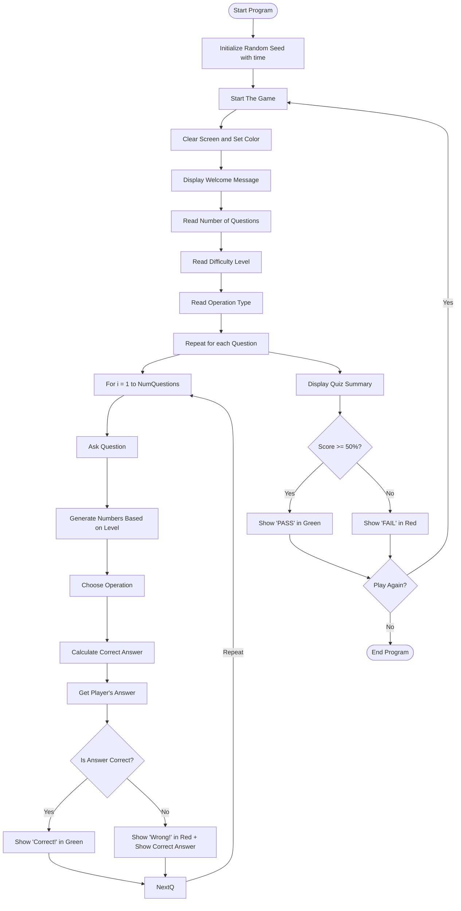

# CalcRush-Game

## Overview
A console-based Math Quiz game developed in C++.
Players are challenged with a set of math questions based on their chosen level and operation type.
The game provides color-coded feedback for each question result and displays an overall score summary at the end of the quiz.

## Features
- Clean and organized console output for an engaging experience.
- Real-time score tracking for correct and incorrect answers.
- Color feedback for each round based on the result:
  - Green for Correct Answer
  - Red for Incorrect Answer
- Final results displayed with a pass/fail outcome.
- Option to replay the quiz after completing a set of questions.

## How to Run

1. **Clone the repository:**

    ```bash
    git clone https://github.com/Muhamed-Shillua/CalcRush-Game.git
    cd CalcRush-Game
    ```

2. **Compile the code using a C++ compiler (e.g., g++):**

    ```bash
    g++ main.cpp -o game
    ```

3. **Run the game:**

    ```bash
    game.exe
    ```

> **Note:** This game is designed to work on Windows due to the use of the `windows.h` library for color management in the console.

## Screenshot


## Flowchart of the Game Logic


## Learning Objectives
This project was developed to improve the following skills:
- Designing user-friendly console-based quiz games.
- Enhancing skills in random number generation for dynamic questions.
- Implementing logical structures to handle multiple levels and operations.
- Managing user inputs and displaying real-time feedback in C++.

## Future Enhancements
- Adding difficulty settings for multiple levels of complexity.
- Porting the game to Linux using ANSI escape codes for color output.
- Implementing user profiles to track quiz performance and history.

## Contact
For any feedback, suggestions, or issues, feel free to open an issue on the [GitHub repository](https://github.com/Muhamed-Shillua/CalcRush-Game/issues).
